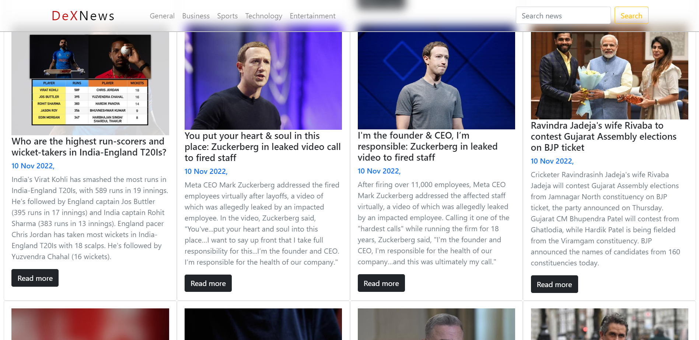

<h1 align="center">  DeX-News-Web-Page  </h1>

 
This project is named as ‘DeX-News’.  This web page is having an interactive user
interface. It fetches data using an ‘Application Program Interface’ (News API). It
shows information/News of different types and different websites at one place.
 

  

 ---

## API 

For API repository(Inshort Unofficial) [Click Me!](https://github.com/cyberboysumanjay/Inshorts-News-API) 
 
For official News-API [Click Me!](https://newsapi.org/)

## Live Deployment

**_[Live Link](https://deveshp007.github.io/DeX-News-Web-Page/)_**

## Tech stack

- Bootstrap
- HTML
- CSS
- JavaScript
- News API
- Inshorts API